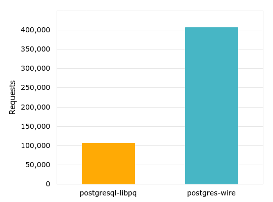

[![License MIT][badge-license]][license]
[![Linux build][badge-travis]][travis]
# Postgres-wire
A native Haskell driver for PostgreSQL.

## Features ##
* No dependencies on C libraries such as libpq-dev.
* Concise Haskell API.
* Binary protocol support.
* First-class notifications support.
* Sending multiple queries in a single batch.
* Built-in prepared statement cache.
* Fast serialization/deserialization.
* Designed with performance in mind.

## Performance ##

Each test consisted of running queries that select 300 rows of 100 bytes each in a loop with 8 concurrent connections to the database server for 10 seconds. The benchmark results were obtained from Intel(R) Core(TM) i7-6700K CPU @ 4.00GHz, 32 GB DDR4, PostgreSQL 9.5.5.

[badge-travis]: https://img.shields.io/travis/postgres-haskell/postgres-wire.svg
[travis]: https://travis-ci.org/postgres-haskell/postgres-wire
[badge-license]: https://img.shields.io/badge/license-MIT-blue.svg?dummy
[license]: https://github.com/postgres-haskell/postgres-wire/blob/master/LICENSE
